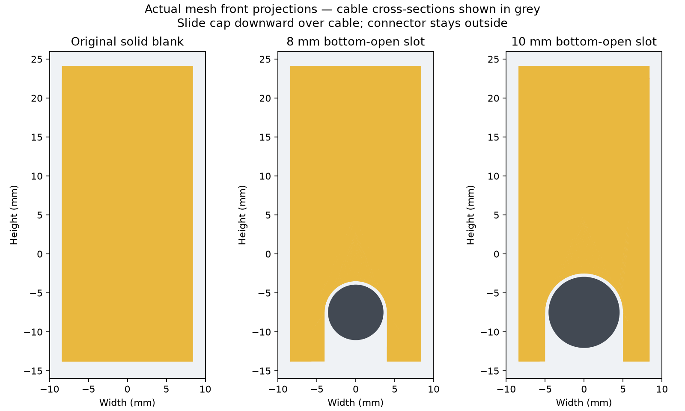

# Top-entry cable passthrough panel — V1 draft

Local remix of [10in Server Rack Patch Panels 1u 12 Keystone Jacks](https://makerworld.com/en/models/576762), by **Dawnchaser**. The original `PatchPanels.3mf` download metadata identifies **BY-NC-SA**, but not its numerical version. Source inspected 2026-09-08, metadata rechecked 2026-09-11. The original file is unchanged and is not included here. See `geometry_check.json` for its SHA-256 and [license status](../../LICENSE.md) before redistribution.

Uses the unnumbered panel's original mesh: 254 mm wide, 44.45 mm tall, 10 mm maximum depth, with its four original round mounting holes. This download contains round mounting holes, regardless of newer profiles mentioned on the model page.

Each of the twelve keystone openings now has a 12 mm-wide channel to the top edge, cut through the entire panel depth. Drop the cable body into the opening from above; the HDMI connector does not have to fit through it. Existing front openings are approximately 14.8 mm wide. Allow clearance: the cable body should be comfortably under 12 mm in diameter. These are open guides, not clamps or strain relief. Load cables before placing another panel directly above, or leave access above the slots.

Use [the panel project](PatchPanel_TOP_ENTRY_12MM_V1.3mf) or [its STL](PatchPanel_TOP_ENTRY_12MM_V1.stl). The STL is in millimeter coordinates, front face down. The 3MF places one copy diagonally on the P2S / PETG / 0.20 mm profile, with three walls and automatic supports off. Confirm filament matches the loaded material. [Before/after diagram](../../docs/previews/cable_panel.png) shows actual mesh projections.

Geometry verification: one connected watertight solid, original external bounds retained, mounting-ear volumes unchanged, twelve clear entry channels, no boundary/nonmanifold edges or degenerate triangles. The source validator cannot follow this downloaded project's external component meshes; the explicitly referenced unnumbered mesh was read in memory and checked independently. No source archive entries were extracted to disk.

Bambu Studio inspection: sliced successfully on the P2S PETG profile, estimated 31.74 g and 1 h 10 min including preparation. Full-height Preview and the connected first-layer footprint were inspected; temporary screenshots are in the ignored local archive. Blender MCP was unavailable, so visual inspection used Bambu Studio. The 3MF is an editable project, without embedded G-code. Validation status: WARN (structural checks passed; physical performance untested).

This is a new, physically untested draft. Print fit, cable clearance and handling strength have not been proven. Opening the top removes the original continuous upper rail; do not force or sharply bend the resulting fingers.

Rebuild with [tools/build_top_entry.py](../../tools/build_top_entry.py), using [the tool instructions](../../tools/README.md). The upstream blank mesh is preserved under `tools/sources/` so rebuilding needs no Downloads files.

## Removable blanking insert

[The blanking-insert project](PatchPanel_BLANKING_INSERT_V1.3mf) contains one blank to close one unused opening, including the top entry slot; [STL](PatchPanel_BLANKING_INSERT_V1.stl). Duplicate it for each opening to cover. Slide it down from above, flat cover facing the panel front and tapered retaining flange behind. Lift it out to reuse the opening. No screws or glue; a loose sliding fit, not a snap latch.

The 11.4 mm stem fits the 12 mm slot with 0.3 mm clearance on each side; front/rear faces straddle the panel with 0.3 mm clearance each. A 16.8 mm cover overlaps the 14.8 mm opening. The top stop protrudes 1.9 mm above the panel, so leave clearance there. The 45-degree rear flange is oriented to print without supports, with the broad front face on the bed.

Checked against all twelve openings at six insertion heights: no geometric interference. One connected manifold solid. Physical fit remains untested: print one first. [Installed preview](../../docs/previews/blanking_inserts.png) shows seven blanks as an example; the project contains only one. Rebuild with [tools/build_blanking_insert.py](../../tools/build_blanking_insert.py).

Bambu Studio sliced the insert successfully with supports off: 3.85 g PETG, 16m37s printing / 24m33s including preparation. The 3MF remains an editable project; no embedded G-code. Structural validation status is WARN only for the usual physical-fit/print verification limitations.

## Cable-friendly removable caps — V1 drafts

These are separate versions of the V1 solid blank, with a **bottom-open rounded
notch through the full depth**. Lower the cable body into the panel first, then
slide the cap down over it. The connector never needs to pass through the cap.
Most of the opening and its top-entry channel are covered; the bottom notch
remains open around the cable. Lift the cap to remove or change cables.

| Slot | Project | STL | Checked cable diameter |
| --- | --- | --- | --- |
| 8 mm | [8 mm cable cap](PatchPanel_CABLE_INSERT_8MM_V1.3mf) | [STL](PatchPanel_CABLE_INSERT_8MM_V1.stl) | Up to 7 mm |
| 10 mm | [10 mm cable cap](PatchPanel_CABLE_INSERT_10MM_V1.3mf) | [STL](PatchPanel_CABLE_INSERT_10MM_V1.stl) | Up to 9 mm, including thicker cables |

Measure the **cable body**, not the HDMI plug. The checked sizes leave 1 mm
diametral allowance; cable shape and print tolerances still need a physical
test. These are guides, not clamps or strain relief. The 10 mm version has
thin 0.7 mm inner stem strips beside the notch, backed by the wider front/rear
flanges: slide gently, do not force or spread them. For multiple cables,
their combined envelope must fit; no bundle fit has been tested.

The original solid blank and panel are unchanged. The caps retain their
16.8 mm cover width, sliding envelope, tapered rear flange and top stop
(1.9 mm above the panel). Print front-face down as supplied, using the
original P2S / PETG / 0.20 mm project settings with supports off. Each project
contains one cap. STL coordinates are millimeters; STL itself is unitless.

**Status: WARN / unprinted.** Geometry checks cover all twelve openings at
six insertion heights, plus clearance around a 7 or 9 mm cylindrical cable.
Structural validation does not prove print quality or real cable fit; slice
and inspect the first layer and rear flange in Bambu Preview, then test one.
The solid blank's earlier slice result does not validate these new variants.

Rebuild into ignored draft output with
[build_cable_insert.py](../../tools/build_cable_insert.py); checks are in
[test_cable_insert.py](../../tools/test_cable_insert.py) and
[the geometry report](cable_insert_geometry_check.json).

## MakerWorld relationship

The panel is a **direct mesh remix** of [Dawnchaser's model 576762](https://makerworld.com/en/models/576762-10in-server-rack-patch-panels-1u-12-keystone-jacks), downloaded as `PatchPanels.3mf`. The twelve top-entry cuts are local changes. The blanking insert is a **locally designed matching accessory**; no separate MakerWorld blank model was downloaded. The 8/10 mm cable caps are local derivatives of that blank, not additional downloaded models. Upstream attribution and CC BY-NC-SA provenance are retained. This model is separate from the TP-Link front/back panels.
